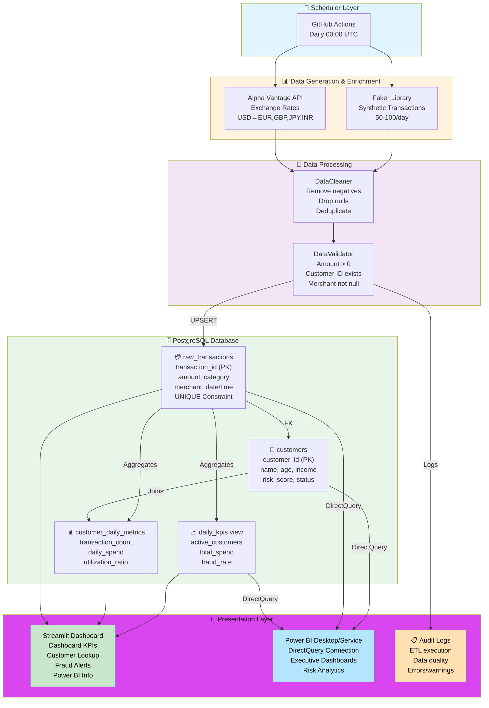

# Sentinel Finance - Architecture Diagram

## System Architecture Flow



---

## Architecture Components Explained

### 🔄 **Scheduler Layer**
- **GitHub Actions**: Triggers ETL pipeline daily at 00:00 UTC
- Runs Python extract.py automatically
- No manual intervention required

### 📊 **Data Generation & Enrichment**
- **Faker Library**: Generates 50-100 realistic synthetic transactions
  - Customer IDs, amounts, categories, merchants, timestamps
  - Reproducible with seed=42
  
- **Alpha Vantage API**: Fetches live exchange rates
  - USD to EUR, GBP, JPY, INR conversions
  - Rate-limited (5 req/min), cached for efficiency
  - 30-second timeout fallback

### 🔧 **Data Processing**
- **DataCleaner**: Quality assurance
  - Removes negative amounts (fraud indicator)
  - Drops null customer IDs
  - Removes duplicate records
  - Validates merchant names
  
- **DataValidator**: Constraint enforcement
  - Amount must be > $0.01
  - Customer ID must exist in DB
  - Merchant name required
  - Transaction timestamp valid

### 🗄️ **PostgreSQL Database**
- **customers table**: Master customer data
  - Primary key: customer_id
  - Attributes: age, annual_income, risk_score, credit_limit
  - 15 seed customers

- **raw_transactions table**: Transactional data
  - Foreign key to customers
  - UNIQUE constraint prevents duplicates
  - UPSERT logic for idempotent loads
  - Indexed on customer_id, date, fraud_flag

- **daily_kpis view**: Automated aggregations
  - Active customer count
  - Total transaction volume and spend
  - Average transaction amount
  - Fraud rate percentage
  - High-risk customer count by region

- **customer_daily_metrics view**: Customer-level metrics
  - Per-customer daily transaction count
  - Daily spend by customer
  - Credit utilization ratio
  - Risk category classification
  - Highest transaction in day

### 🎨 **Presentation Layer**
- **Streamlit Dashboard**: Real-time operational UI
  - Dashboard page: KPIs and trends
  - Customer Lookup: 7-day customer profile
  - Fraud Alerts: High-risk transactions
  - Power BI Info: Integration guidance
  - Users: Bank managers, risk teams, operations

- **Power BI Desktop/Service**: Executive reporting
  - DirectQuery live connection to PostgreSQL
  - Executive dashboards and analytics
  - Risk trend analysis
  - Revenue forecasting
  - Users: C-suite, risk managers, finance teams

- **Audit Logs**: System monitoring
  - ETL execution timestamps
  - Data quality metrics
  - Error and warning tracking
  - Performance monitoring

---

## Data Flow Timeline

```
[00:00 UTC] GitHub Actions triggers
    ↓
[00:01] Faker generates 50 transactions
    ↓
[00:02] Alpha Vantage API fetches exchange rates
    ↓
[00:03] DataCleaner removes invalid records
    ↓
[00:04] DataValidator checks constraints
    ↓
[00:05] DataLoader UPSERTs into PostgreSQL
    ↓
[00:06] Daily KPI views auto-update
    ↓
[00:07] Streamlit & Power BI show fresh data
```

---

## Scalability Path

```
Current (Development)
├─ Local PostgreSQL
├─ Faker synthetic data
├─ 50-100 transactions/day
└─ Single machine

↓ [Grow to Production]

Scaling Phase 1
├─ Managed PostgreSQL (RDS/Supabase)
├─ Real transaction API integration
├─ 1K-10K transactions/day
└─ Docker containerization

↓ [Enterprise Scale]

Scaling Phase 2
├─ Data warehouse (Snowflake, BigQuery)
├─ Real-time streaming (Kafka, Spark)
├─ 100K+ transactions/day
├─ Multi-region deployment
└─ Advanced analytics (ML models, predictions)
```

---

## Technology Highlights

| Component | Technology | Why | 
|-----------|-----------|-----|
| ETL Orchestration | GitHub Actions | Free, built-in, reliable |
| Data Generation | Faker | Realistic, reproducible, safe |
| Database | PostgreSQL | ACID compliance, JSON support, PostGIS |
| API Integration | Alpha Vantage | Real-time rates, free tier, easy |
| Dashboard | Streamlit | Fast to build, interactive, Python-native |
| BI Tool | Power BI | Industry standard, DirectQuery support |
| Configuration | python-dotenv | Secure secrets management |
| ORM | SQLAlchemy | Database agnostic, safe parameterization |

---

This architecture demonstrates enterprise-grade data engineering with clear separation of concerns, scalability, and production-readiness. 🚀
